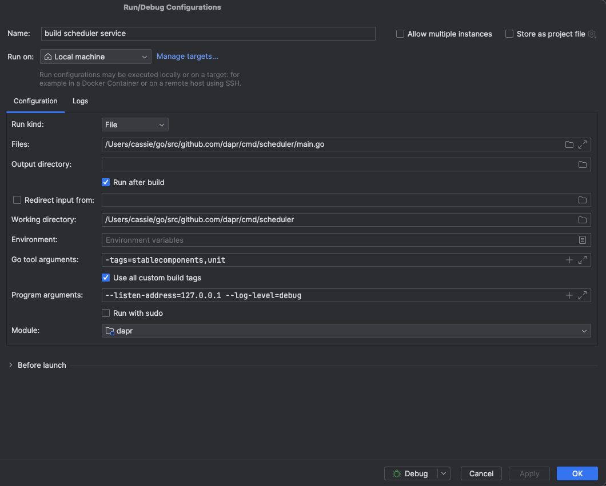
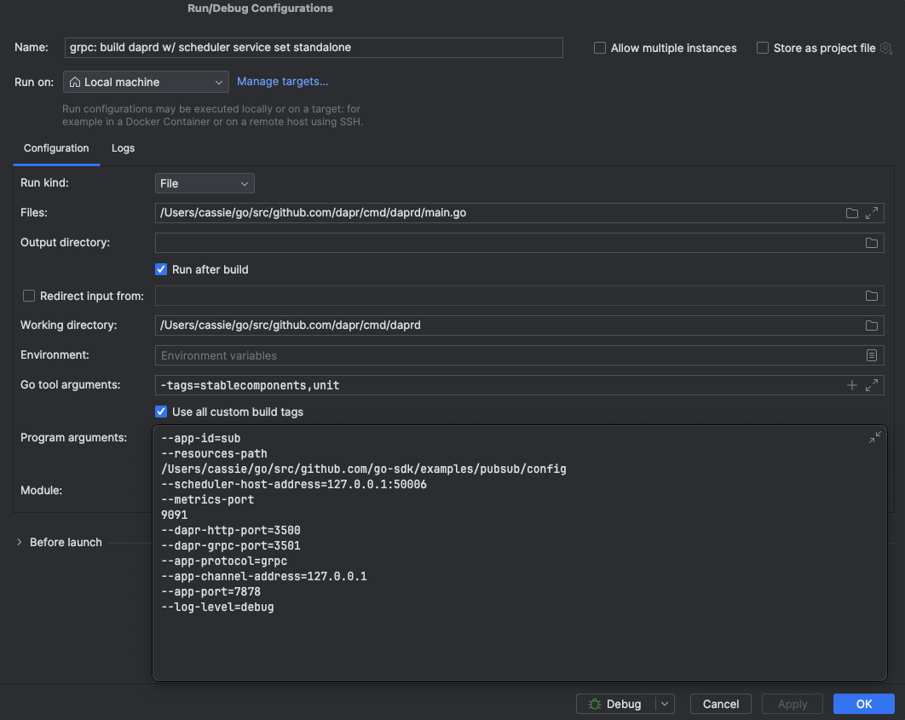

# test-apps
Repo for storing app code for testing dapr

## Scheduling jobs via http
1. Run Scheduler w/ config

2. Run Sidecar w/ app port & http set:

3. Run app: `go run scheduler-http.go` from scheduler-http dir
4. Schedule Job: 
```
curl -X POST \
  http://localhost:3500/v1.0/job/schedule/cass1 \
  -H "Content-Type: application/json" \
  -H 'dapr-app-id: sub' \
  -d '{
        "data": {
            "@type": "type.googleapis.com/google.type.Expr",
            "expression": "cass1"
        },
        "schedule": "@every 2s",
        "repeats": 2
    }'
```

## Scheduling jobs via grpc
1. Run Scheduler w/ config

2. Run Sidecar w/ app port & grpc set:

3. Run app: `go run scheduler-grpc.go` from scheduler-grpc dir
4. Schedule Job:
```
grpcurl -H 'dapr-app-id: sub' -d '{"job":{"name": "cass1", "data": {"@type": "type.googleapis.com/google.type.Expr","expression":"cass1"}, "schedule": "@every 2s", "repeats": 2}}' -plaintext 127.0.0.1:3501 dapr.proto.runtime.v1.Dapr.ScheduleJob
```
